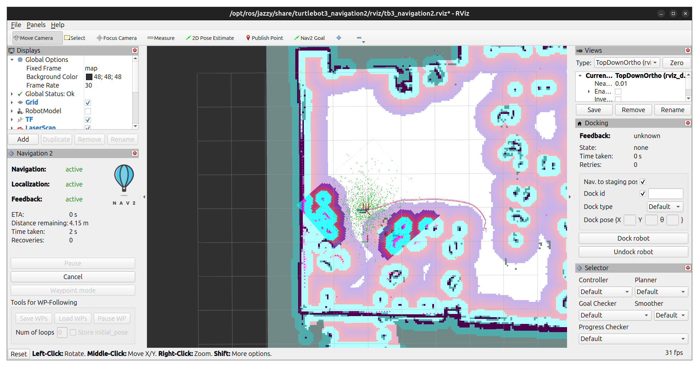

# Project 8, ROS2 Navigation Stack, Group 1
#### Progress Munoriarwa & Malcolm Benedict

### Part 1

Using the recommended parameter ranges, nine total sets of parameters were examined, representing all combinations of the three radii and scaling factors. The inflation radius governed how far from a detected obstacle the cost would be increased. A large radius would result in the movement cost of a space being altered even a significant distance from the object itself. The scaling factor determined how the cost within the radius scaled. Therefore, the cost of any given space was based on its relative position within the radius and the scaling factor.

**Baseline**
|`cost_scaling_factor`|`inflation_radius`|
| :-----------------: | :--------------: |
| 3.0                 | 0.70             |

**Test 1**
|`cost_scaling_factor`|`inflation_radius`|
| :-----------------: | :--------------: |
| 2.0                 | 0.70             |

**Test 2**
|`cost_scaling_factor`|`inflation_radius`|
| :-----------------: | :--------------: |
| 5.0                 | 0.70             |

**Test 3**
|`cost_scaling_factor`|`inflation_radius`|
| :-----------------: | :--------------: |
| 3.0                 | 0.15             |

**Test 4**
|`cost_scaling_factor`|`inflation_radius`|
| :-----------------: | :--------------: |
| 3.0                 | 0.45             |

**Test 5**
|`cost_scaling_factor`|`inflation_radius`|
| :-----------------: | :--------------: |
| 2.0                 | 0.15             |

**Test 6**
|`cost_scaling_factor`|`inflation_radius`|
| :-----------------: | :--------------: |
| 5.0                 | 0.15             |

**Test 7**
|`cost_scaling_factor`|`inflation_radius`|
| :-----------------: | :--------------: |
| 3.0                 | 0.45             |

**Test 8**
|`cost_scaling_factor`|`inflation_radius`|
| :-----------------: | :--------------: |
| 5.0                 | 0.45             |

Route planning was done with Test 8 parameters. However, the robot never moved, even with a valid path to target and an initial pose estimate. Nav2 would show that it was attempting to follow the path, but no actual movement happened. This was even after the initial pose estimate had been set, and the Turtlebot moved around with teleop. This issue had been encountered in previous Turtlebot experiments, however, the author cannot remember how they resolved the issue.

Next, the obstacle layer parameters were varied, and a human was introduced to the environment to see the effects on the cost map. The obstacles max range parameter governed the range at which obstacles should be detected, while the raytrace max range parameter governed obstacle clearing distance. Unfortunately, no meaningful difference could be observed.

**Baseline**
|`raytrace_max_range`|`obstacle_max_range`|
| :----------------: | :----------------: |
| 3.0                | 2.5                |

**Test 1**
|`raytrace_max_range`|`obstacle_max_range`|
| :----------------: | :----------------: |
| 1.5                | 1.25               |

**Test 2**
|`raytrace_max_range`|`obstacle_max_range`|
| :----------------: | :----------------: |
| 6.0                | 5.0                |

## Part 2 — Keepout and Speed Filter Zones
### The taped floor zones

### Keepout zone rendered

### Routes around the keepout zone

