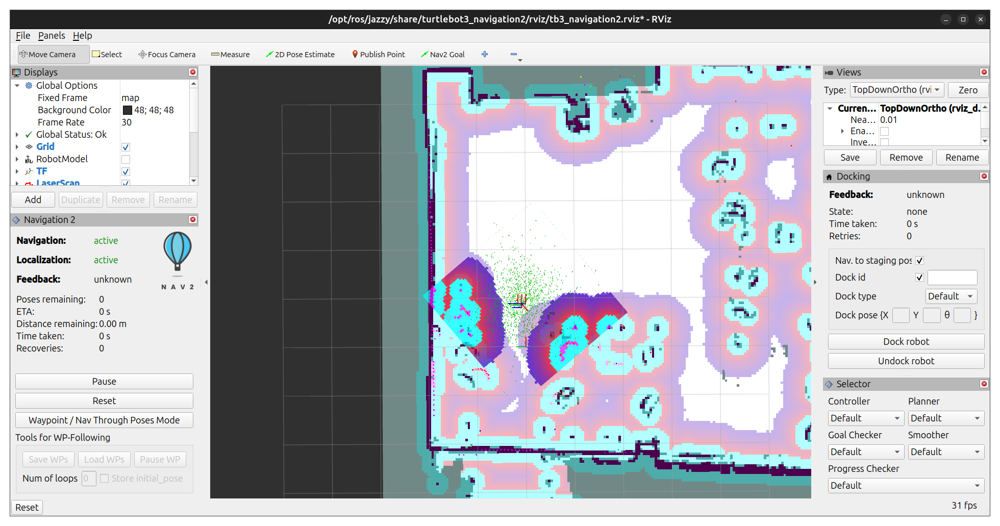
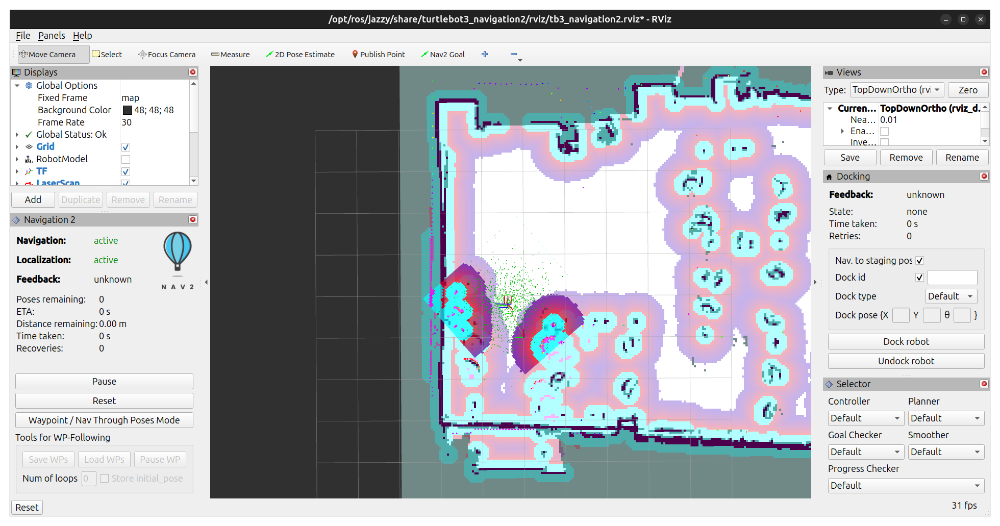
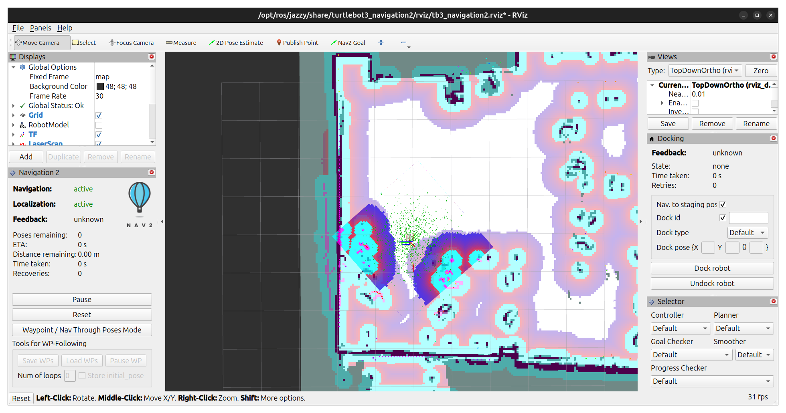
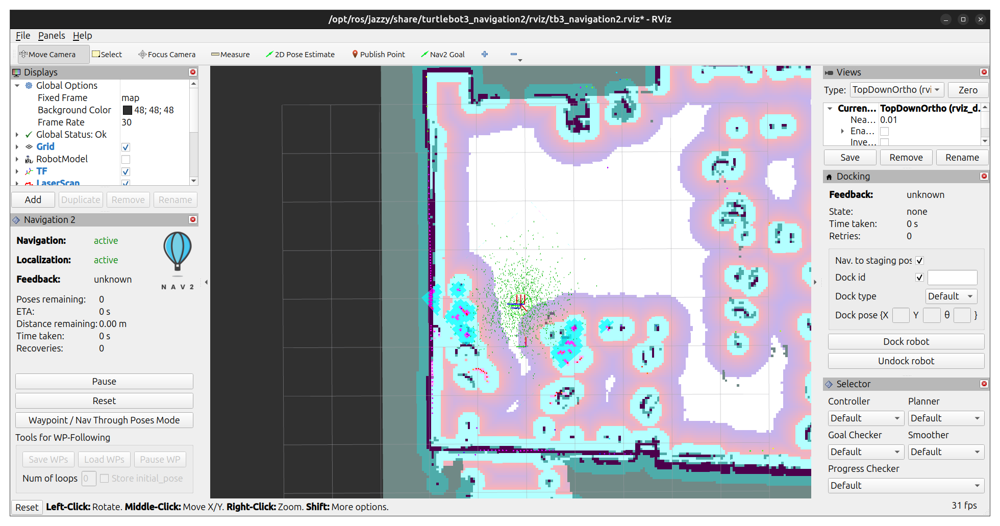
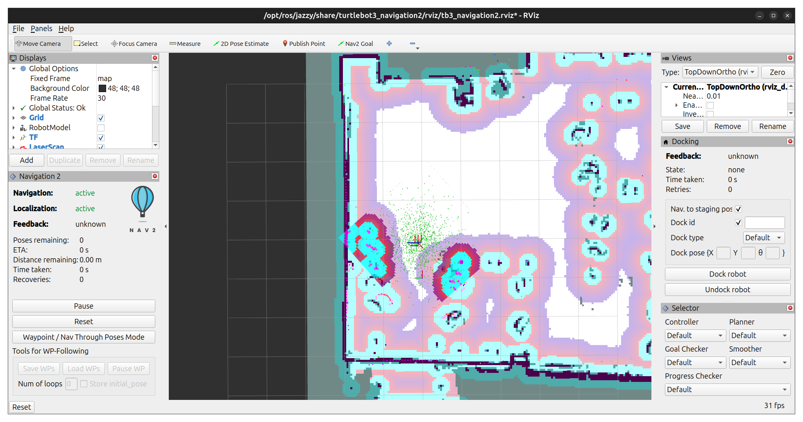
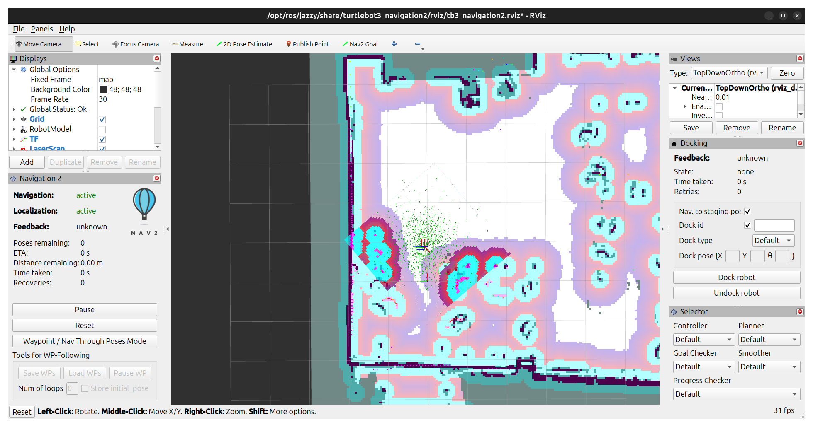
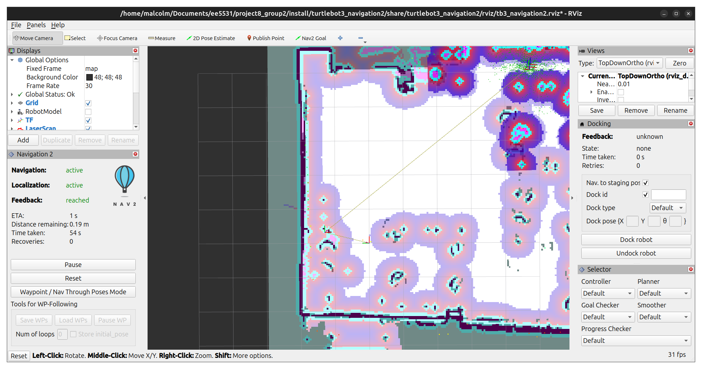
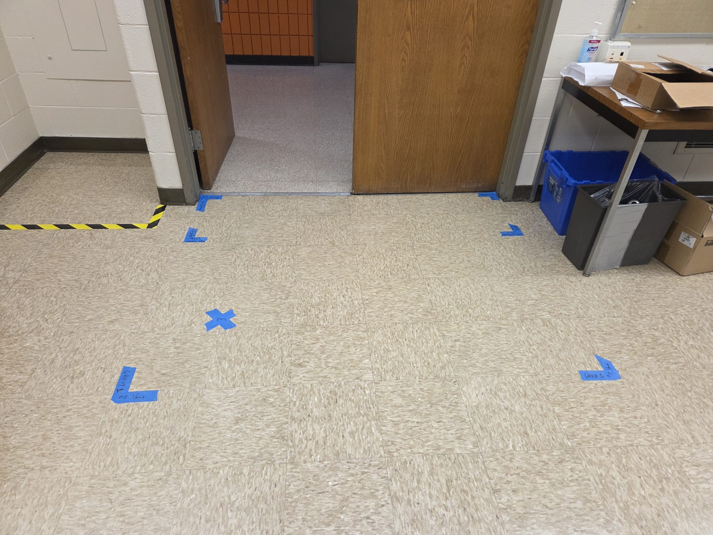
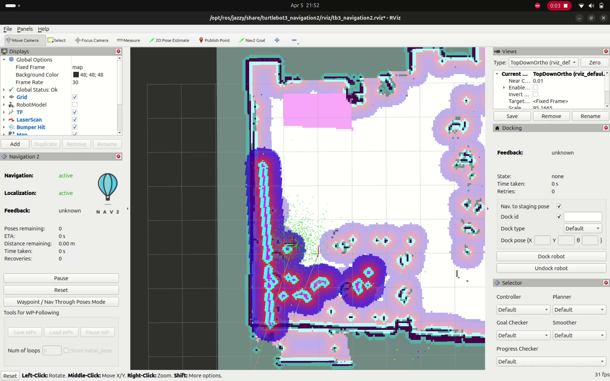
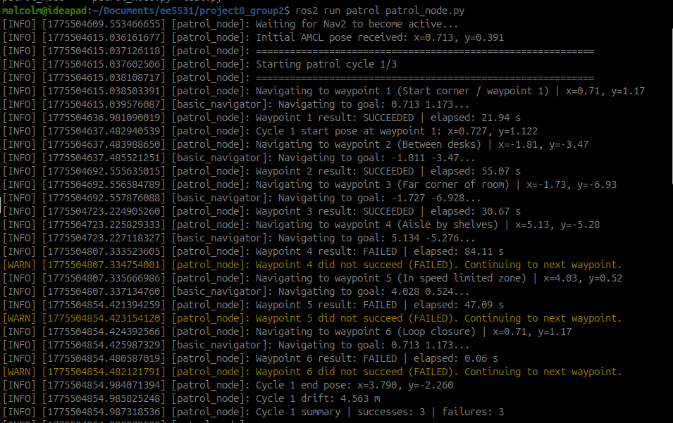

# Project 8, ROS2 Navigation Stack, Group 1
#### Progress Munoriarwa, Malcolm Benedict, and Eineje Ameh

## Introduction

This exercise covers the Nav2 stack, tuneable parameters and autonomous navigation. Like the other exercises for this course, this was performed in ROS2 Jazzy on Ubuntu 24.04 LTS. The environment variables were exported from the `turtlebot_connect.sh` script, which exports the proper domain ID. The `nav2_params.yaml` file is based on the one included in the turtlebot3 repository. Initially, the default configuration file recommended by the Nav2 documentation was used. However, this generated issues, particularly with regards to `/cmd_vel`. The Turtlebot expects a TwistStamped message, while the default configuration produces a `Twist` message. Therefore, the robot would not respond to nav. goals until the proper config. filed was substituted in.

## Setup

### Basic Setup

1. Clone the repository in the home directory.

`git clone <SSH-URL or HTTPS-URL>`

2. Change directories into the cloned repository and then build the package.
```
$ cd ~/project8_group1
$ colcon build
```
3. Export your domain ID and Turtlebot model. Alternatively, `turtlebot_connect.sh` may also be sourced.
```
$ export TURTLEBOT3_MODEL=burger
$ export RMW_IMPLEMENTATION=rmw_fastrtps_cpp
$ export ROS_DOMAIN_ID= #Your Turtlebot ID here
```
4. Secure Shell into the Turtlebot.
```
$ ssh ubuntu@#Your Turtlebot IP Address
```
5. On the Turtlebot, run the following to initialize it.
```
$ ros2 launch turtlebot3_bringup robot.launch.py
```

### Part 1
1. Edit `config/nav2_params.yaml` with your desired values of `cost_scaling_factor` and `inflation_radius`. Save the file.
2. Open up a new terminal window export the params and source it.
```
$ source install/setup.bash
$ export TURTLEBOT3_MODEL=burger
$ export RMW_IMPLEMENTATION=rmw_fastrtps_cpp
$ export ROS_DOMAIN_ID= #Your Turtlebot ID here
```
3. Run the Turtlebot Nav2 launch file.
```
$ ros2 launch turtlebot3_navigation2 navigation2.launch.py map:=maps/map_eerc722.yaml params_file:=config/nav2_params.yam
```
4. The Nav2 params. are configured to initially assume the Turtlebot is located on the marked start position. If it is not, you will need to correct its position estimate with the "2D Pose Estimate" Button.
5. Observe the effects of your Costmap parameter changes. 
6. If desired, set a Nav2 Goal, and watch the Turtlebot navigate to it.

### Part 2

TODO

### Part 3 & 4
1. Open three new terminal windows, export the params and source them.
```
$ source install/setup.bash
$ export TURTLEBOT3_MODEL=burger
$ export RMW_IMPLEMENTATION=rmw_fastrtps_cpp
$ export ROS_DOMAIN_ID= #Your Turtlebot ID here
```
2. In the first terminal, run the Turtlebot Nav2 launch file.
```
$ ros2 launch turtlebot3_navigation2 navigation2.launch.py map:=maps/map_eerc722.yaml params_file:=config/nav2_params.yam
```
3. In the second terminal, run Turtlebot teleop.
```
$ ros2 run turtlebot3_teleop teleop_keyboard
```
4. In the third terminal, run the patrol node.
```
$ ros2 run patrol patrol_node.py 
```
5. Quickly switch back to the teleop terminal and set the linear velocity to 0.05m/s.
6. Once the patrol node receives an AMCL pose estimate, kill the teleop node with `Ctrl-C`.
7. You should be able to observe the turtlebot making three loops on the patrol path, with the drift printing in the terminal.

## Part 1 — Costmap Layer Configuration

Using the recommended parameter ranges, nine total sets of parameters were examined, representing all combinations of the three radii and scaling factors. The inflation radius governed how far from a detected obstacle the cost would be increased. A large radius would result in the movement cost of a space being altered even a significant distance from the object itself. The scaling factor determined how the cost within the radius scaled. Therefore, the cost of any given space was based on its relative position within the radius and the scaling factor.

<div style="text-align: center; margin-left: auto; margin-right: auto; width: 75%">

**Baseline**
|`cost_scaling_factor`|`inflation_radius`|
| :-----------------: | :--------------: |
| 3.0                 | 0.70             |


**Test 1**
|`cost_scaling_factor`|`inflation_radius`|
| :-----------------: | :--------------: |
| 2.0                 | 0.70             |


**Test 2**
|`cost_scaling_factor`|`inflation_radius`|
| :-----------------: | :--------------: |
| 5.0                 | 0.70             |


**Test 3**
|`cost_scaling_factor`|`inflation_radius`|
| :-----------------: | :--------------: |
| 3.0                 | 0.15             |


**Test 4**
|`cost_scaling_factor`|`inflation_radius`|
| :-----------------: | :--------------: |
| 3.0                 | 0.45             |


**Test 5**
|`cost_scaling_factor`|`inflation_radius`|
| :-----------------: | :--------------: |
| 2.0                 | 0.15             |


**Test 6**
|`cost_scaling_factor`|`inflation_radius`|
| :-----------------: | :--------------: |
| 5.0                 | 0.15             |


**Test 7**
|`cost_scaling_factor`|`inflation_radius`|
| :-----------------: | :--------------: |
| 3.0                 | 0.45             |


**Test 8**
|`cost_scaling_factor`|`inflation_radius`|
| :-----------------: | :--------------: |
| 5.0                 | 0.45             |


</div>

Route planning was done with Test 8 parameters. The goal was set in a narrow pathway, however, this did not seem to particularly effect the navigation. Perhaps an even narrower hallway, such that the Turtlebot would be forced to navigate through an obstacle's inflation radius would have more of an effect. However, there were several times where the Turtlebot briefly passed through the inflation radius with no noticeable effect.

<div style="text-align: center; margin-left: auto; margin-right: auto; width: 75%">


</div>


Next, the obstacle layer parameters were varied, and a human was introduced to the environment to see the effects on the cost map. The obstacles max range parameter governed the range at which obstacles should be detected, while the raytrace max range parameter governed obstacle clearing distance. Unfortunately, no meaningful difference could be observed.

<div style="text-align: center; margin-left: auto; margin-right: auto; width: 75%">

**Baseline**
|`raytrace_max_range`|`obstacle_max_range`|
| :----------------: | :----------------: |
| 3.0                | 2.5                |


**Test 1**
|`raytrace_max_range`|`obstacle_max_range`|
| :----------------: | :----------------: |
| 1.5                | 1.25               |


**Test 2**
|`raytrace_max_range`|`obstacle_max_range`|
| :----------------: | :----------------: |
| 6.0                | 5.0                |


</div>

## Part 2 — Keepout and Speed Filter Zones





## Part 3 — Autonomous Patrol Script



While completing this section,there was an issue where the Turtlebot would successfully reach a goal, but report it had failed, as seen in the output log. This may have been the result of an issue where some node would become desynced from the others, causing transforms to be dropped. This tended to happen during long runs.

## Part 4 — Patrol Execution and Analysis

### Recovery

While navigating to the waypoints in the back of the room, the Turtlebot ran into one of the chair feet. This happened because the chair feet are so low that the Turtlebot cannot see them. It stayed stuck for about 10 seconds, before backing up, adjusting the angle and driving around the chair successfully and continuing the patrol. This could be solved by increasing the inflation radius or decreasing cost scaling, to cause Nav2 to give the chairs a wider clearance.

### Drift Analysis

| Cycle | Start pose (x, y) | End pose (x, y) | Drift (m) |
| :---: | :---------------: | :-------------: | :-------: |
|1      |                   |                 |           |
|2      |                   |                 |           |
|3      |                   |                 |           |